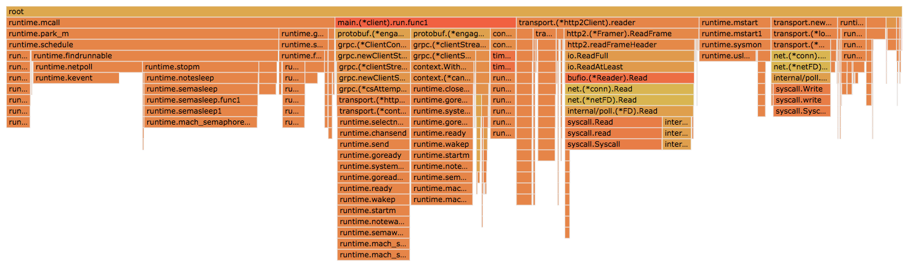
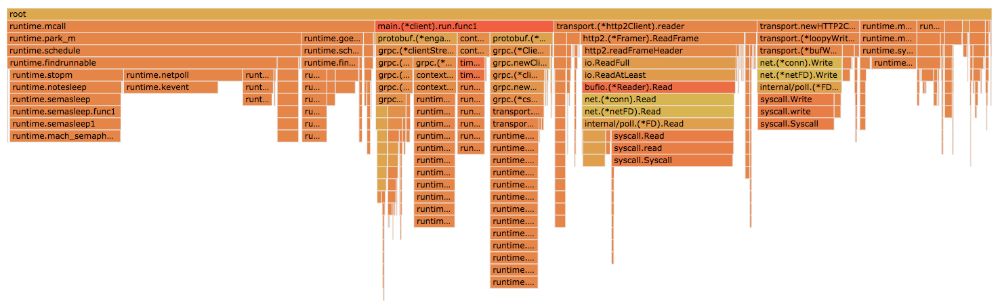

# Results

## Spec

```
MacBook Pro
Processor 2.9 GHz Intel Core i7
Memory 16 GB 2133 MHz LPDDR3
```

## Sample

```
2018-11-14 17:19:07.563044132 -0800 PST m=+60.002487855
Run time (secs): 60
Connection concurrency: 1
Message type: shipbulkdata
Num messages streamed per sample: 10

=======================================================
Client: client0
Addresses: [127.0.0.1:12345 127.0.0.1:23456]
=======================================================
10000 samples of 179560 events
Cumulative:	2.663875026s
HMean:		248.575µs
Avg.:		266.387µs
p50: 		237.313µs
p75:		268.012µs
p95:		481.747µs
p99:		621.806µs
p999:		761.495µs
Long 5%:	567.367µs
Short 5%:	190.234µs
Max:		1.002456ms
Min:		163.395µs
Range:		839.061µs
StdDev:		89.409µs
Rate/sec.:	3753.93
=======================================================
10000 samples of 179560 events
Cumulative:	2.804578049s
HMean:		263.574µs
Avg.:		280.457µs
p50: 		253.337µs
p75:		285.305µs
p95:		488.448µs
p99:		628.17µs
p999:		796.247µs
Long 5%:	578.632µs
Short 5%:	198.641µs
Max:		897.929µs
Min:		163.559µs
Range:		734.37µs
StdDev:		87.839µs
Rate/sec.:	3565.60
=======================================================

=======================================================
Client: client1
Addresses: [127.0.0.1:23456 127.0.0.1:34567]
=======================================================
10000 samples of 179560 events
Cumulative:	2.647154724s
HMean:		246.674µs
Avg.:		264.715µs
p50: 		234.429µs
p75:		265.785µs
p95:		483.521µs
p99:		619.817µs
p999:		765.571µs
Long 5%:	568.248µs
Short 5%:	190.383µs
Max:		876.209µs
Min:		168.733µs
Range:		707.476µs
StdDev:		90.109µs
Rate/sec.:	3777.64
=======================================================
10000 samples of 179560 events
Cumulative:	2.804823549s
HMean:		263.417µs
Avg.:		280.482µs
p50: 		253.073µs
p75:		284.125µs
p95:		496.039µs
p99:		628.748µs
p999:		784.594µs
Long 5%:	582.644µs
Short 5%:	200.083µs
Max:		1.034913ms
Min:		162.96µs
Range:		871.953µs
StdDev:		88.985µs
Rate/sec.:	3565.29
=======================================================

=======================================================
Client: client2
Addresses: [127.0.0.1:34567 127.0.0.1:12345]
=======================================================
10000 samples of 179560 events
Cumulative:	2.727125809s
HMean:		255.187µs
Avg.:		272.712µs
p50: 		243.12µs
p75:		273.711µs
p95:		493.612µs
p99:		632.993µs
p999:		744.357µs
Long 5%:	576.14µs
Short 5%:	196.732µs
Max:		910.557µs
Min:		166.804µs
Range:		743.753µs
StdDev:		89.415µs
Rate/sec.:	3666.86
=======================================================
10000 samples of 179560 events
Cumulative:	2.864990813s
HMean:		270.281µs
Avg.:		286.499µs
p50: 		261.803µs
p75:		293.311µs
p95:		490.84µs
p99:		628.752µs
p999:		782.886µs
Long 5%:	579.438µs
Short 5%:	199.856µs
Max:		978.119µs
Min:		172.807µs
Range:		805.312µs
StdDev:		86.031µs
Rate/sec.:	3490.41
=======================================================
```

## Comparison by varying connection concurrency

```
Run time (secs): 60
Message type: stream 10 msgs

+------------------------+-------------------+--------------+--------------+--------------+
| connection concurrency | samples collected |          avg |          p75 |          p95 |
+------------------------+-------------------+--------------+--------------+--------------+
|                      1 |            333298 |    276.268µs |    279.495µs |    491.044µs |
+------------------------+-------------------+--------------+--------------+--------------+
|                     10 |            593640 |   1.387657ms |   1.718451ms |   2.223423ms |
+------------------------+-------------------+--------------+--------------+--------------+
|                    100 |            647200 |  11.311667ms |  14.407776ms |  16.703479ms |
+------------------------+-------------------+--------------+--------------+--------------+
|                    500 |            657000 |  58.279957ms |  60.906887ms |  71.824427ms |
+------------------------+-------------------+--------------+--------------+--------------+
|                   1000 |            636000 | 126.885709ms | 133.873733ms | 151.025663ms |
+------------------------+-------------------+--------------+--------------+--------------+
|                   5000 |            480000 | 902.431268ms |  947.57333ms | 1.073416351s |
+------------------------+-------------------+--------------+--------------+--------------+
```

## Comparison of how ops/sec scales when client draws data from multiple servers 

With a few changes to the client & server code, here are some results when 1 client is made to acquire data from 1 server and then 2 servers simultaneously (via multiple routines).
Note that the 2 servers are separate processes, however all the clients and the servers are on the same box.

```
Run time (secs): 30

+---------------------+---------------------+-------------------+-----------+
|      scenario       |  type of message(s) | samples collected | rate/sec. |
+---------------------+---------------------+-------------------+-----------+
|  1 client, 1 server |               hello |            223907 |   7099.49 |
+---------------------+---------------------+-------------------+-----------+
| 1 client, 2 servers |               hello |            302858 |  11492.81 |
+---------------------+---------------------+-------------------+-----------+

+---------------------+---------------------+-------------------+-----------+
|      scenario       |  type of message(s) | samples collected | rate/sec. |
+---------------------+---------------------+-------------------+-----------+
|  1 client, 1 server |        stream 1 msg |            225957 |   7904.53 |
+---------------------+---------------------+-------------------+-----------+
| 1 client, 2 servers |        stream 1 msg |            301574 |  11363.40 |
+---------------------+---------------------+-------------------+-----------+

+---------------------+---------------------+-------------------+-----------+
|      scenario       |  type of message(s) | samples collected | rate/sec. |
+---------------------+---------------------+-------------------+-----------+
|  1 client, 1 server |      stream 10 msgs |            184896 |   6327.68 |
+---------------------+---------------------+-------------------+-----------+
| 1 client, 2 servers, 1 client |      stream 10 msgs |            237736 |   8961.98 |
+---------------------+---------------------+-------------------+-----------+

+---------------------+---------------------+-------------------+-----------+
|      scenario       |  type of message(s) | samples collected | rate/sec. |
+---------------------+---------------------+-------------------+-----------+
|  1 client, 1 server | stream bulk 10 msgs |            181509 |   6219.76 |
+---------------------+---------------------+-------------------+-----------+
| 1 client, 2 servers | stream bulk 10 msgs |            244962 |   9225.95 |
+---------------------+---------------------+-------------------+-----------+
```

## Profiling

Flame graphs of CPU profiles on client that streams 10 messages from server (Run time: 30 secs)

* 1 client, 1 server, stream 10 msgs


* 1 client, 2 servers, stream 10 msgs

